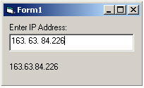

<div align="center">

## IP Address in MS Masked Edit Control


</div>

### Description

Enter IP Address into Microsoft Masked Edit Control, check if entry is valid (0-255) and jump to the next section of the mask using the dot (.) as separator, if the section is shorter than 3 digits (such as : 192.168.24.1).
 
### More Info
 
Place a maskedbox (MaskEdBox1) on your form. This code works if the user types the DOT (.) character to move to the next section in the maskbox when entering ip address.

myIPValue var contains the final ip address. If declared as public it can be used anywhere.


<span>             |<span>
---                |---
**Submitted On**   |
**By**             |[Shauli](https://github.com/Planet-Source-Code/PSCIndex/blob/master/ByAuthor/shauli.md)
**Level**          |Advanced
**User Rating**    |4.3 (13 globes from 3 users)
**Compatibility**  |VB 6\.0
**Category**       |[Miscellaneous](https://github.com/Planet-Source-Code/PSCIndex/blob/master/ByCategory/miscellaneous__1-1.md)
**World**          |[Visual Basic](https://github.com/Planet-Source-Code/PSCIndex/blob/master/ByWorld/visual-basic.md)
**Archive File**   |[](https://github.com/Planet-Source-Code/shauli-ip-address-in-ms-masked-edit-control__1-53946/archive/master.zip)


### Source Code

```
Dim myIPValue As String
Private Sub Form_Load()
MaskEdBox1.Mask = "###.###.###.###"
MaskEdBox1.PromptChar = Chr(32) 'space character
End Sub
Private Sub MaskEdBox1_KeyPress(KeyAscii As Integer)
Dim mySplit() As String, c As Integer, jumpC As Integer, tmpString As String, tmpSplit As String
If KeyAscii = 46 Then
  mySplit = Split(MaskEdBox1.Text, Chr(46), -1)
  For c = 0 To UBound(mySplit)
    If IsNumeric(mySplit(c)) Then jumpC = jumpC + 4
    If Len(Trim(mySplit(c))) < 3 Then mySplit(c) = Space(3 - Len(Trim(mySplit(c)))) & Trim(mySplit(c))
  Next c
  tmpString = mySplit(0) & "." & mySplit(1) & "." & mySplit(2) & "." & mySplit(3)
  MaskEdBox1.Text = tmpString
  MaskEdBox1.SelStart = jumpC
  KeyAscii = 0
End If
End Sub
Private Sub MaskEdBox1_KeyUp(KeyCode As Integer, Shift As Integer)
Dim validSplit() As String, v As Integer, validString As String
validSplit = Split(MaskEdBox1.Text, Chr(46), -1)
For v = 1 To UBound(validSplit)
  If validSplit(v) = "  " Or v = UBound(validSplit) Then
    If Val(Trim(validSplit(v - 1))) > 255 Or (v = UBound(validSplit) And Val(Trim(validSplit(v))) > 255) Then
      MsgBox "Invalid value"
      If Val(validSplit(3)) > 0 Then v = v + 1
      validSplit(v - 1) = "  "
      validString = validSplit(0) & "." & validSplit(1) & "." & validSplit(2) & "." & validSplit(3)
      MaskEdBox1.Text = validString
      MaskEdBox1.SelStart = (v - 1) * 4
      Exit For
    End If
  End If
Next v
myIPValue = Replace(MaskEdBox1.Text, " ", "")
End Sub
```

